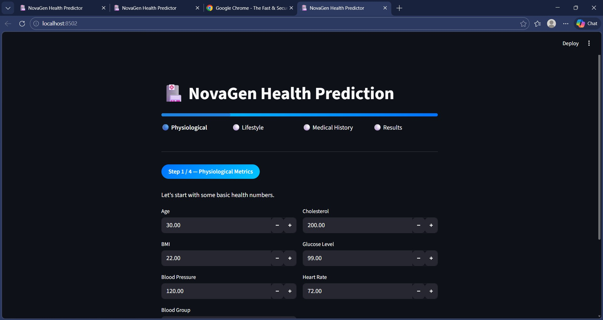

<p align="center">
  <h1 align="center">🏥 NovaGen Health Prediction</h1>
  <p align="center">
    ML-powered health risk prediction using a Random Forest classifier.
    <br />
    Built with <strong>FastAPI</strong> · <strong>Streamlit</strong> · <strong>scikit-learn</strong>
  </p>
</p>

---

## Overview

<p align="center">
  
</p>

LifeForward Health Prediction analyses patient vitals, lifestyle habits, and medical history to predict whether an individual is at **High Risk** or **Low Risk** for adverse health outcomes. The system uses a Random Forest model trained on 22 engineered features and exposes predictions through both a REST API and an interactive web dashboard.

## Features

- **Step-by-step wizard UI** — guided input flow with a progress bar (Streamlit)
- **REST API** — JSON-based prediction endpoint (FastAPI + Uvicorn)
- **Random Forest model** — ~94 % accuracy, ~96 % recall
- **One-command training** — retrain the model any time with a single script

## Tech Stack

| Layer | Technology |
|-------|-----------|
| ML / Training | scikit-learn, pandas, NumPy |
| API | FastAPI, Uvicorn, Pydantic |
| Frontend | Streamlit |
| Serialisation | joblib |

## Project Structure

```
NovaGen Health Prediction/
├── api.py                 # FastAPI backend
├── app.py                 # Streamlit wizard UI
├── requirements.txt
├── dataset/
│   └── novagen_dataset.csv
├── models/
│   └── health_model.pkl   # trained model (generated)
├── notebook/              # EDA & experimentation notebooks
└── src/
    ├── __init__.py
    ├── train.py           # model training script
    └── predict.py         # prediction utilities
```

## Getting Started

### Prerequisites

- Python 3.9+

### Installation

```bash
# Clone the repository
git clone https://github.com/princejha-dev/NovaGen-Health-Risk-Prediction.git
cd /NovaGen-Health-Risk-Prediction

# Create & activate a virtual environment
python -m venv myenv
myenv\Scripts\activate        # Windows
# source myenv/bin/activate   # macOS / Linux

# Install dependencies
pip install -r requirements.txt
```

### Train the Model

```bash
python src/train.py
```

### Run the API

```bash
uvicorn api:app --reload
```

The API will be live at `http://127.0.0.1:8000`.

### Run the Dashboard

```bash
streamlit run app.py
```

Open `http://localhost:8501` in your browser and walk through the wizard to get a prediction.

## 🚀 Deployed Application

The application is deployed and accessible online:

- **Frontend (Streamlit)**: **[Click Here](https://novagen.streamlit.app/)**
- **Note**: The backend API is not required for deployment — the model loads directly in the Streamlit app for predictions.

> ⚠️ **Disclaimer**: This model is trained on synthetic data for demonstration purposes only. Predictions should NOT be used for real medical decisions. Consult a healthcare professional for accurate health assessments.

## API Reference

### `POST /predict`

Send a JSON body with the 22 features and receive a risk prediction.

<details>
<summary>Example request</summary>

```json
{
  "Age": 30, "BMI": 22, "Blood_Pressure": 120, "Cholesterol": 200,
  "Glucose_Level": 99, "Heart_Rate": 72, "Sleep_Hours": 7,
  "Exercise_Hours": 1, "Water_Intake": 3, "Stress_Level": 5,
  "Smoking": 0, "Alcohol": 0, "Diet": 1, "MentalHealth": 0,
  "PhysicalActivity": 1, "MedicalHistory": 0, "Allergies": 0,
  "Diet_Type__Vegan": false, "Diet_Type__Vegetarian": false,
  "Blood_Group_AB": false, "Blood_Group_B": false, "Blood_Group_O": true
}
```
</details>

<details>
<summary>Example response</summary>

```json
{
  "prediction": "Low Risk (Healthy)"
}
```
</details>

## Author

**[Prince Jha](https://github.com/princejha-dev)**
🔗 [github.com/princejha-dev/LifeForward-Health-Risk-Prediction](https://github.com/princejha-dev/NovaGen-Health-Risk-Prediction)

## License

This project is open-source and available under the [MIT License](LICENSE).
